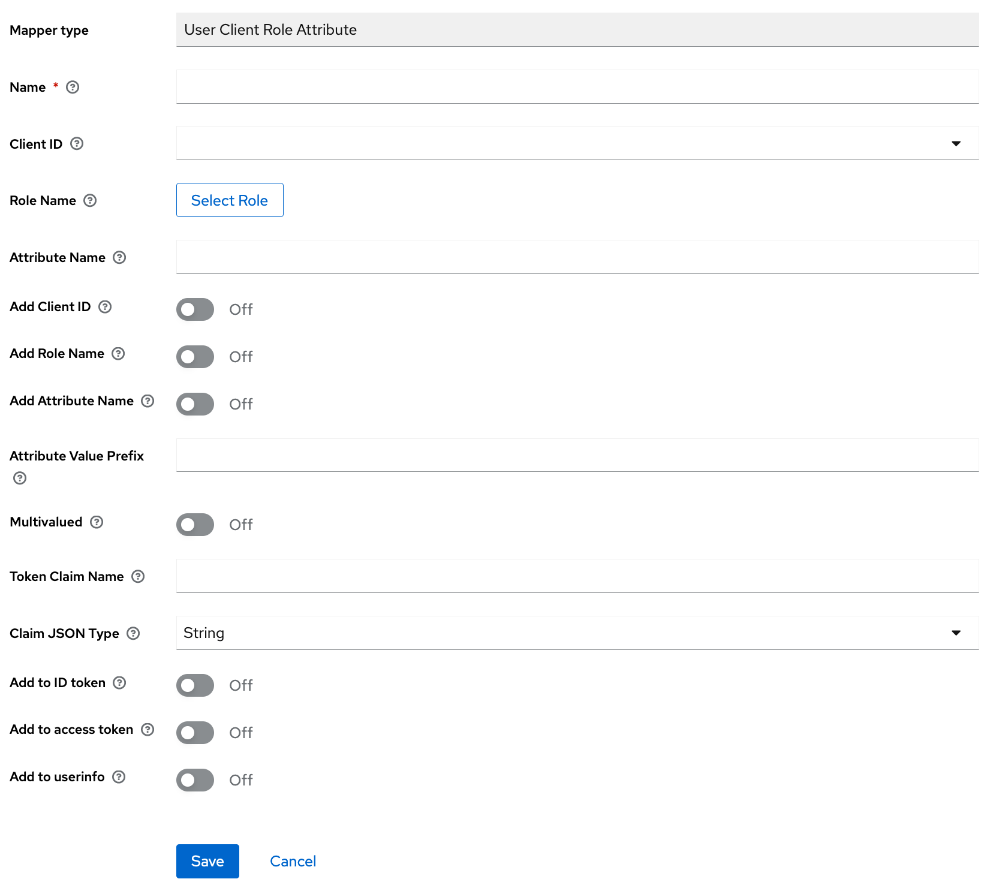

# Keycloak client-role-attribute-mapper

This is a custom provider implementation to map client role attributes to token claims. 

Why custom? Because Keycloak doesn't offer any per default.

**Note:** This is currently developed and tested using **Keycloak 21**

## Usage

Copy the latest released `client-role-attribute-mapper-{version}.jar` into the `providers/` directory of
your Keycloak installation and restart Keycloak.

When creating a Mapper: *Add mapper* > *By configuration* > *User Client Role Attribute*

## Build

Use *Java 17 (`skd env`)* and hit:

```bash
mvn package
```

## Test

Spin up pre-configured docker container with:

```bash
docker compose up
```

make sure **provider jar files is built before**.

### Token

Get a token using [httpie](https://httpie.io/), [jq](https://stedolan.github.io/jq/) 
and [jwt-cli](https://github.com/mike-engel/jwt-cli):

```bash
http -f :8080/auth/realms/test/protocol/openid-connect/token client_id=test username=user password=secret grant_type=password | jq -r .access_token | jwt decode -
```

or use the built-in client scopes evaluation feature [here](http://localhost:8080/auth/admin/master/console/#/test/clients/788d3b42-6deb-4119-adec-6cfb12655398/clientScopes/evaluate).

## Additional

This is made because we wanted to use RabbitMQ with OAuth2 and the JWT, but mapping realm roles to scopes seemed not
as the best solution, and we liked to stick to client roles.

Currently, this is tested manually and its planned to add some *real tests* in the future.

This is our first shot on a custom Keycloak provider implementation so far, so there might be some weird stuff in here.

## Screenshots


